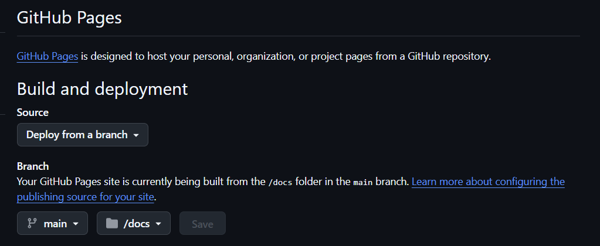

# HSMA Quarto Slide Template

This provides a starting point for making HSMA slides using the Quarto platform.

Make your changes to the `slides.qmd` file.

Then run `quarto render`.

The final output can be hosted on Github Pages.

The output of `slides.qmd` is set to automatically be `docs/index.html`, so point your github pages site to the docs folder.

## Notes

After making any changes to the *custom.scss* file, close any quarto preview windows and/or terminals you have open, then start the preview from scratch. Updates will not be pulled through when saving the updated file or re-clicking on preview, even if the page appears to reload.

## Installed extensions

Various extensions have been pre-installed for convenience.

These include

- [quarto-stlite](https://github.com/whitphx/quarto-stlite) for embedding of interactive streamlit apps
- [quarto-verticator](https://github.com/Martinomagnifico/quarto-verticator) for visibility and easy navigation of vertical slide stacks
- [reveal-header](https://github.com/shafayetShafee/reveal-header) for adding a header

## Useful shortcuts

- Press 'q' to turn the mouse to/from a laser pointer.
- Press 'f' to put the slides into fullscreen
- Press 's' to bring up the speaker view
- Hold 'Alt' and click somewhere on the slide to zoom in. Click again while holding 'Alt' to return to the original zoom level.
